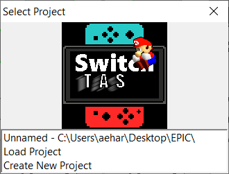
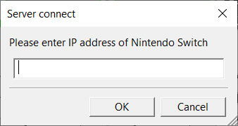
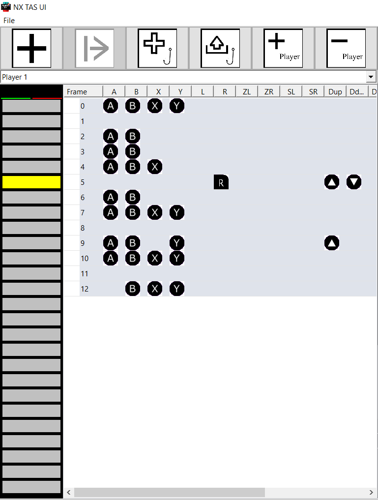
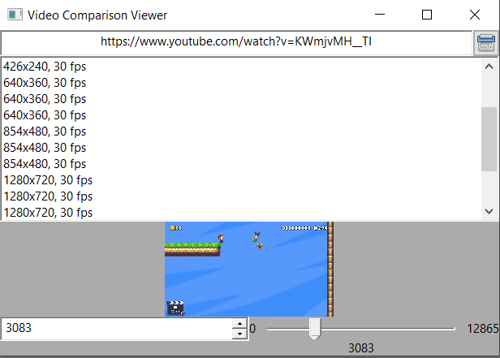
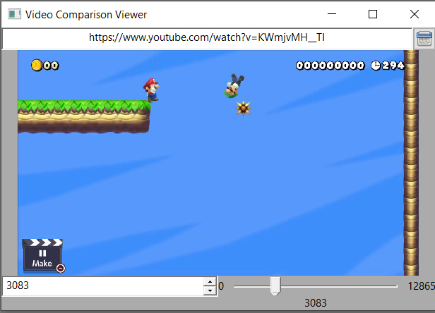

# SwiTAS
A TAS toolkit for the Nintendo Switch. Usuable via hardware, homebrew and emulator. Join [the Discord](https://discord.gg/3zDmqpQ)!

# [RELEASES HERE](https://github.com/TheGreatRambler/SwiTAS/releases)

## Why this?
You have probably heard of the [TASBOT Nintendo Switch setup](https://www.youtube.com/watch?v=VXRL7dUVT-M), [Switch Fightstick](https://github.com/shinyquagsire23/Switch-Fightstick) or even the macros of [JoyCon Droid](https://play.google.com/store/apps/details?id=com.rdapps.gamepad&hl=en_US). This program was created to address the shortcomings of these other, similar, projects.

In the case of the first two, there is a very important problem; they emulate a Horipad, which does not actually have any analog sticks. As you can imagine, this makes TASing games beyond a 2D platformer close to impossible. In the case of JoyCon Droid, while supporting analog sticks and even motion controls, the nature of bluetooth makes it a poor protocol for TAS.

In the spirit of TASBot, it is generally considered more prestigious to display the final product via unmodified console hardware. This is the approach taken by all of the above products. Dealing with unmodified hardware, however, imposes many limitations during TAS creation. Introducing... this project!

Having access to the entire system via CFW introduces a lot of freedoms, so this project intends to place this functionality into a standard PC application, much like Bizhawk or other TAS creators. This power allows you to tas with the freedom of an emulator even though this is not an emulator.

Yuzu support is planned and will be out soon, check back frequently.

This editor is intended to most closely resemble the [FCEUX TAS Editor](http://www.fceux.com/web/help/taseditor/).

## How To Use:
* Create a project, load a project, or load a recent project with the dialog at start.

<div align=”center”></div> 

* Select the IP address of your switch in order to take advantage of Switch homebrew for TASing. This menu appears at start and in `File/Set Switch IP`. (**THIS FEATURE IS CURRENTLY UNSUPPORTED**)

<div align=”center”></div>

* Select a frame in the *Piano Roll* to begin editing frames. Add frames with `Ctrl + Plus`, create and remove savestate blocks with the buttons on the top, and create and select players. All the familiar commands are here, right click to see them all. Included are `Paste Place`, which only adds buttons if they are not present, and `Paste Insert`, which inserts the frame below the selected one. `Undo` and `Redo` support are planned.

<div align=”center”></div>

* To allow for seamless usage, button inputs support keyboards, gamepads, and selecting the corresponding button in the bottom right. The keyboard bindings (which mirror that of [Yuzu](https://yuzu-emu.org/)) are as follows:
```json
"buttons": {
	"A": {
		"viewName": "A Button",
		"triggerKeybind": "A",
	},
	"B": {
		"viewName": "B Button",
		"triggerKeybind": "S",
	},
	"X": {
		"viewName": "X Button",
		"triggerKeybind": "Z",
	},
	"Y": {
		"viewName": "Y Button",
		"triggerKeybind": "X",
	},
	"L": {
		"viewName": "L Button",
		"triggerKeybind": "Q",
	},
	"R": {
		"viewName": "R Button",
		"triggerKeybind": "W",
	},
	"ZL": {
		"viewName": "ZL Trigger",
		"triggerKeybind": "1",
	},
	"ZR": {
		"viewName": "ZR Trigger",
		"triggerKeybind": "2",
	},
	"SL": {
		"viewName": "SL Trigger",
		"triggerKeybind": "E",
	},
	"SR": {
		"viewName": "SR Trigger",
		"triggerKeybind": "R",
	},
	"DUP": {
		"viewName": "Up on Dpad",
		"triggerKeybind": "T",
	},
	"DDOWN": {
		"viewName": "Down on Dpad",
		"triggerKeybind": "G",
	},
	"DLEFT": {
		"viewName": "Left on Dpad",
		"triggerKeybind": "F",
	},
	"DRIGHT": {
		"viewName": "Right on Dpad",
		"triggerKeybind": "H",
	},
	"PLUS": {
		"viewName": "Plus Button",
		"triggerKeybind": "N",
	},
	"MINUS": {
		"viewName": "Minus Button",
		"triggerKeybind": "M",
	},
	"HOME": {
		"viewName": "Home Button",
		"triggerKeybind": "B",
	},
	"CAPT": {
		"viewName": "Capture Button",
		"triggerKeybind": "V",
	},
	"LS": {
		"viewName": "Left Stick Press",
		"triggerKeybind": "3",
	},
	"RS": {
		"viewName": "Right Stick Press",
		"triggerKeybind": "4",
	}
}
```
To change these values, refer to the corresponding entry in `mainSettings.json`. Each character need to be typed with it's lowercase equivalent to register. As of now, gamepad support is restricted to a wired pro controller on Windows 10. No drivers are needed. Select the gamepad in `File/List Joysticks` and you're good to go. Note, joystick inputs are not registered until you press the lock button underneath either the right or left joysticks.

<div align=”center”></div>

NX TAS UI also has a video view, in order to use a video from youtube/twitter/twitch/etc to compare against your TAS. All that is needed is YouTube DL, which can be installed with a simple `sudo -H pip install --upgrade youtube-dl`. To use, simply enter the URL of your video and press enter. A few seconds later, select your format and wait for it to download. Now, when selecting frames in the *Piano Roll*, the viewer will automatically adjust the selected frame of the video. The video is saved to your filesystem so you can easily load the video again later. To use this feature, press `File/List Recent Comparison Videos`.

<div align=”center”></div>
<div align=”center”></div>

## Thanks
- [Hamhub7](https://github.com/hamhub7): The creator of Nx-TAS
- [MonsterDruide1](https://github.com/MonsterDruide1): Providing many valuable insights into the behavior of hardware-based TAS setups
- [AtlasNX](https://twitter.com/atlasnx?lang=en): For their help during development
- Members of the wxWidgets forums: For being incredibly useful for every question
- [Shakkar23](https://github.com/shakkar23): For being a chad, obviously
